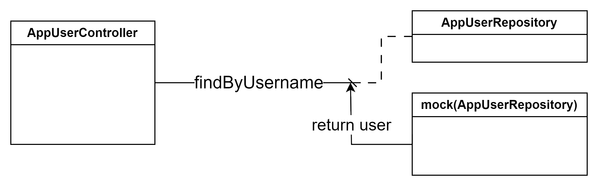

Ohjelmistokehityksen teknologioita - Seminaarityö

# Java Spring Boot -projektin yksikkötestaaminen

Seminaari 1 - Testaus

**Katja Jääskeläinen**

### Sisällysluettelo

[1. Johdanto](#johdanto) </br>
[2. Käytetyt tekniikat](#käytetyt-tekniikat) </br>
[2.1. Sanity check](#sanity-check) </br>
[3. AppUserRESTControllerin testaaminen](#appuserrestcontrollerin-testaaminen) </br>
[3.1. AppUser-luokan ja AppUserRepositoryn testaaminen](#appuser-luokan-ja-appuserrepositoryn-testaaminen) </br>
[4. ProjectRESTControllerin ja Project-luokan testaaminen](#projectrestcontrollerin-ja-project-luokan-testaaminen) </br>
[5. Ylitsepääsemättömät ongelmat](#ylitsepääsemättömät-ongelmat) </br>
[6. Pohdinta](#pohdinta) </br>

## Johdanto

Perehdyin yksikkötestaamiseen Ohjelmistoprojekti 2 -kurssilla toteuttamamme projektin Spring Bootilla toteutetun backendin parissa. 

Halusin perehtyä aiheeseen tarkemmin, sillä testausosaamista arvostetaan työelämässä ja aiemmilla kursseillani minulle ei ole jäänyt aikaa panostaa testaamiseen. Projektin edetessä myös huomasi kuinka paljon valmiit testit olisivat nopeuttaneet ohjelmiston kehittämistä, kun manuaalista testaamista olisi voinut vähentää huomattavasti ja olisi voitu varmistua kaikkien tiimin jäsenten suorittavan sovitut testit ennen pull requestin luomista.

Työkaluiksi valitsin JUnit Jupiter, MockMvc ja Mockito -kirjastot, sillä backend toimii REST rajapintana ja nämä työkalut sekä soveltuvat sen testaamiseen että ovat yleisesti käytössä. 

Tavoitteenani oli testata mahdollisimman paljon backendin toiminnasta käytettävissä olevan ajan puitteissa. 


## Käytetyt tekniikat

Ohjelmistoprojekti 2 -kurssin backend toteutettiin Java versiolla 17 ja Spring Boot versiolla 3.2.1. [Linkki projektiin.](https://github.com/jinblo/TimeManagement/tree/main/TimeManagementBE)

[JUnit Jupiter](https://junit.org/junit5/docs/current/user-guide/) on osa Spring Boot Starter Test -kirjastoa. Se kattaa laajennukset testien kirjoittamiseen ja ajamiseen. 

Myös [MockMvc](https://docs.spring.io/spring-framework/reference/testing/spring-mvc-test-framework.html) sisältyy myös Spring Boot Starter Test -kirjastoon. MockMvc on viitekehys, jota käytetään Spring MVC sovellusten yksikkötestaamisessa. Sen avulla voidaan lähettää Controllerille pyyntöjä ja verrata saatua vastausta odotettuun vastaukseen. 

[Mockito](https://site.mockito.org/) on toinen testaamisen viitekehys. Sillä luodaan ”mock” rajapintoja, joiden avulla voidaan toisintaa komponenttien toiminta käyttämättä itse komponenttia, ja siten eriyttää eri komponenttien testit toisistaan. Esimerkiksi repositoriosta voidaan Mockiton avulla palauttaa haluttu vastaus controllerille (Kuva 1).



Kuva 1. AppUserControllerin, AppUserRepositoryn ja mock(AppUserRepository)n välinen yhteys.

### Sanity check

Lähdin liikkeelle Spring Bootin [webtestausohjeen](https://spring.io/guides/gs/testing-web) avulla. Ensimmäisenä testasin applikaation käynnistymisen nopealla "sanity check" -testillä. 

```
@SpringBootTest
class TimeManagementBeApplicationTests {

	@Test
	void contextLoads() {
	}

}
```

Seuraavaksi testasin yhteyden toimivuuden HttpServerTestillä:

```
@Test
void requestShouldReturnUnauthorized() throws Exception {
  assertThat(this.restTemplate.getForObject("http://localhost:" + port + "/",
    String.class)).contains("Authentication error: Full authentication is required to access this resource");
}
```

Testi palauttaa Authentication errorin, sillä sovelluksemme vaatii käyttäjän tunnistautumisen.

## AppUserRESTControllerin testaaminen

Backend projektimme toimii REST rajapintana, johon frontend lähettää http-pyyntöjä ja joka lähettää tietoja takaisin json-muodossa. 

Aloitin myös jokaisen `@Controller` testaamisen lyhyellä sanity checkillä, jolla varmistin testin pääsevän kiinni oikeaan Controlleriin. 

```
@SpringBootTest
public class AppUserRESTControllerTests {

  @Autowired
  AppUserRESTController appUserRESTController;

  @Test
  void contextLoads() throws Exception {
    assertNotNull(appUserRESTController);
  }

}
```

Vielä ennen yhdenkään metodin testaamista on valmisteltava testausympäristö. `@BeforeEach` annotaatiolla annettu koodi suoritetaan ennen jokaista testiä, ja näin valmistellaan puhdas testausympäristö. Controllerille annettavat parametrit ovat `@Mock` rajapintoja, jotka mallintavat annetun komponentin toiminnan. Huomioitavaa, että `@Controller` luominen testaamista varten vaatii vastaavan konstruktorin `@Controller` luokkaan.

```
  @BeforeEach
  public void setUp() throws Exception {
    AppUserRESTController controller = new AppUserRESTController(appUserRepository, userDetailsService, jwtService);
    mockMvc = MockMvcBuilders.standaloneSetup(controller).build();
  }
```

Koska en ollut varma miten Spring Security vaikuttaa testaamiseen, päätin aloittaa testien rakentamisen applikaation ainoasta suojaamattomasta metodista, käyttäjän rekisteröitymisestä. Käyttäjä rekisteröidään lähettämällä "/users" endpointiin post-pyyntö, jossa on mukana käyttäjän tiedot json-muodossa.
Post-pyyntö luodaan ja suoritetaan MockMvc:n avulla, sille annetaan sisällöksi json-muotoinen käyttäjä, ja odotetaan pyynnön palauttavan vastauksena `HttpStatus.CREATED` ja `"User succesfully added"`.

```
  @Test
  void createUser_ValidData_ShouldReturnCreated() throws Exception {
    AppUser user = new AppUser("firstname", "lastname", "username", "password");
    mockMvc.perform(MockMvcRequestBuilders.post("/users")
        .contentType(MediaType.APPLICATION_JSON)
        .content(toJson(user)))
        .andExpect(status().isCreated())
        .andExpect(content().string("User successfully added"));
  }
```

Post-pyynnön yhteydessä controller tarkistaa repositoriosta, onko annettu käyttäjänimi jo käytössä. Jos käyttäjänimi löytyy repositoriosta, palauttaa controller `HttpStatus.CONFLICT` ja `"Username already exists"`. Tämän toiminnallisuuden testaamiseksi repositorion pitää palauttaa `DataIntegrityViolationException`, ja se on mahdollista mallintaa Mockiton avulla. Mockito kaappaa annetun pyynnön ja palauttaa määritellyn vastauksen. 

```
Mockito.when(appUserRepository.save(Mockito.any(AppUser.class)))
  	.thenThrow(new DataIntegrityViolationException("Username already exists"));
```

Post-pyynnöllä on yhteensä neljä eri polkua, edellä mainittujen lisäksi epäkelpo data palauttaa `HttpStatus.UNPROCESSABLE_ENTITY` ja muissa virhe tilanteissa `HttpStatus.INTERNAL_SERVER_ERROR`. Pyrin luomaan [testit AppUserRESTControllerin](https://github.com/jinblo/TimeManagement/blob/main/TimeManagementBE/src/test/java/TeamRed/TimeManagementBE/AppUserRESTControllerTests.java) kaikkien metodien kaikille eri poluille. Vain `HttpStatus.INTERNAL_SERVER_ERROR` polut jäivät testaamatta, sillä en keksinyt uutta virhetapausta, joka olisi läpäissyt muut polut.

### AppUser-luokan ja AppUserRepositoryn testaaminen

Koska käytän Mockitoa testatessani controllerin toimintaa, pitää repositorio ja luokka testata erikseen. Kokonaisuuden toimintaa testataan end-to-end-testauksessa, ja siihen käytetään eri työkaluja, kuten RobotFramework. Yksikkötestauksessa tarkoitus on testata koodia erillisinä yksikköinä, ja tarkastaa yksittäisten komponenttien toiminta. 

Projektimme AppUserRepository sisältää CrudRepositoryn toimintojen lisäksi `findByUsername` ja `existsByUsername` -funktiot. Testasin [AppUserRepositoryn](https://github.com/jinblo/TimeManagement/blob/main/TimeManagementBE/src/test/java/TeamRed/TimeManagementBE/AppUserRepositoryTests.java) ja [AppUser-luokan](https://github.com/jinblo/TimeManagement/blob/main/TimeManagementBE/src/test/java/TeamRed/TimeManagementBE/AppUserTests.java) toiminnan JUnit Jupiter `@DataJpaTest`llä. Näissä testeissä ei tarvittu MockMvc- tai Mockito-työkaluja, sillä repositoriolla ja luokalla ei ole vastaavia riippuvuuksia kuin controllerilla.


## ProjectRESTControllerin ja Project-luokan testaaminen

[ProjectRESTControllerTests](https://github.com/jinblo/TimeManagement/blob/main/TimeManagementBE/src/test/java/TeamRed/TimeManagementBE/ProjectRESTControllerTests.java) testejä muodostaessani törmäsin erikoiseen virheeseen, jonka aiheuttajasta en ihan päässyt selvyyteen. Kun AppUserRESTControllerTests käyttää `@Mock` annotaatiota riippuvuuksien yhteydessä, vaatii ProjectRESTControllerTests `@MockBean` annotaation. `@Mock` annotaatiolla sovellus ei käynnisty, vaan herjaa "Failed to load ApplicationContext". Muilta osin luokka ja testien alustaminen tapahtui vastaavasti kuin AppUserRESTControllerTests.

AppUserRESTControllerin testaaminen oli melko suoraviivainen, controllerilla on riippuvuuksia vain AppUser-luokkaan liittyen. ProjectRESTControllerilla on Project-luokan lisäksi riippuvuuksia myös AppUser-, Entry- ja UserProjectRole-luokkiin, jotka tulee mallintaa testeihin (Kuva 2).


Kuva 2. ProjectControllerin riippuvuuksia.

Esimerkiksi yksittäisen projektin hakeminen palauttaa projektin ja siihen liittyvät kirjaukset. Controller hakee ensin projektin repositoriosta, tarkistaa sitten onko pyynnön lähettänyt käyttäjä mukana projektilla, ja hakee vielä projektin kirjauksia riippuen käyttäjän roolista projektilla.

Tässä tapauksessa Mockitoa tarvitaan sekä projektin hakemiseen, että käyttäjän roolin hakemiseen. 

```
  @Test
  public void getProjectById_ValidData_ShouldReturnOk() throws Exception {
    Project project = new Project("New project");
    project.setId(1L);
    when(projectRepository.findById(1L)).thenReturn(Optional.of(project));
    when(userDetailsService.getUserRole(1L)).thenReturn(Role.OWNER);
    mockMvc.perform(get("/projects/1"))
        .andExpect(status().isOk())
        .andExpect(content().json(toJson(project)));
  }
```

Sain luotua testit kaikille `ProjectRESTController` metodeille, mutta en aivan kaikille metodien haaroille. Testaamatta jäi käyttäjien hallinnointi projektilla, kirjausten palauttaminen projektin mukana, sekä osa `HttpStatus.INTERNAL_SERVER_ERROR` haaroista. Monimutkaisemman json-olion luominen testausympäristössä osoittautui yllättävän haastavaksi ja aika loppui kesken.

Loin myös `Project`-luokalle muutaman [testin](https://github.com/jinblo/TimeManagement/blob/main/TimeManagementBE/src/test/java/TeamRed/TimeManagementBE/ProjectTests.java), joissa testasin käyttäjien ja kirjausten lisäämistä projektille.


## Ylitsepääsemättömät ongelmat

[EntryRESTControllerTests](https://github.com/jinblo/TimeManagement/blob/main/TimeManagementBE/src/test/java/TeamRed/TimeManagementBE/EntryRESTControllerTests.java) jäi varsin lyhyeksi, sillä en onnistunut useista yrityksistä huolimatta muodostamaan uudesta kirjauksesta json-oliota, jonka controller olisi hyväksynyt. Yrittäessäni luoda uuden `Entry` objektin, kaatui prosessi puuttuvaan LocalDate- ja LocalTime-tukeen. Editorin ehdottama ratkaisu moduulin lisäämisestä ei ratkaissut ongelmaa, enkä onnistunut löytämään muutakaan toimivaa ratkaisua. 

Myös [LoginTests](https://github.com/jinblo/TimeManagement/blob/main/TimeManagementBE/src/test/java/TeamRed/TimeManagementBE/LoginTests.java) jäi vajaaksi. Käyttäjän autentikointi ja JSON Web Tokenin muodostaminen osoittautuivat varsin monimutkaiseksi kokonaisuudeksi, ja työskenneltyäni projektissa frontendin puolella ei kokonaisuuden toiminta auennut käytettävissä olevan ajan puitteissa.


## Pohdinta

Yksikkötestaaminen on erittäin hyödyllinen työkalu ohjelmistokehittämisen tueksi. Testit kannattaisi tehdä samaa tahtia sovelluksen kehityksen kanssa, ja päivittää aina tarvittaessa suurimman hyödyn saavuttamiseksi. Näin voitaisiin varmistaa helposti ja nopeasti aikaisemmin kehitettyjen ominaisuuksien toiminta uusia toiminnallisuuksia kehitettäessä. Testitapaukset olisi myös helpompi kirjoittaa samalla kun kehittää itse toiminnallisuutta, tai jopa ennen toiminnallisuuden kehittämistä TDD:n ([Test Driven Development](https://testdriven.io/test-driven-development/)) periaatteiden mukaisesti, jolloin haluttu toiminta olisi helppo varmentaa suorittamalla ensin kirjoitettu testi. 


En ollut aikaisemmin käyttänyt Mockitoa, ja muukin testaamisosaamiseni oli varsin heikkoa. Opin luomaan erilaisia testejä eri testitapauksia varten, sekä opin kuinka testataan sovelluksen eri tasoja. Opin myös eri työkalujen merkityksen ja käyttötarkoituksen, ja seuraavaan projektiini aion kehittää testejä jo alusta alkaen. Testejä tehdessä löysin pari tapausta joille voisi lisätä virheenkäsittelyä controlleriin, kuten jos projekteja hakiessa käyttäjää ei löydy.
Testien kehittäminen lisäsi myös omaa ymmärrystäni projektin toiminnasta, Ohjelmistoprojekti 2 -kurssilla keskityin enemmän frontendin kehittämiseen, ja monet backendin ratkaisut jäivät hieman epäselviksi. 

Testien luomista projektille voisi vielä jatkaa, olisi mielenkiintoista yrittää saavuttaa 100% kattavuus koko projektille. Lisäksi suoritin testit vain kehitysympäristössä, joten olisi mielenkiintoista kokeilla testien suorittamista julkaisuympäristössä tai yrittää automatisoida testien ajaminen julkaisuputkeen.

